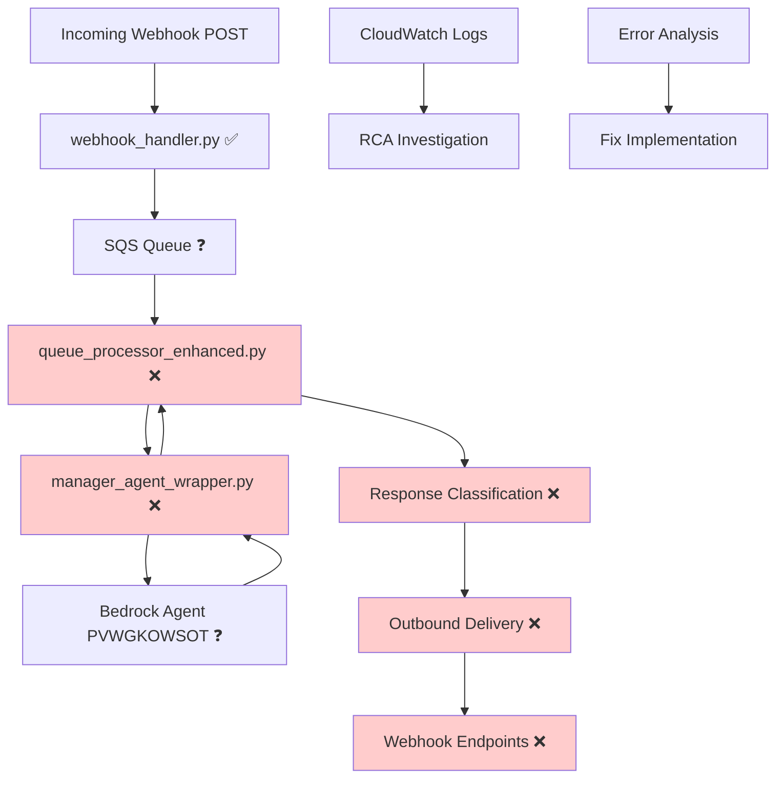

# Design Document

## Overview

This is a root cause analysis and troubleshooting design for the broken webhook processing system. The system is currently failing to process webhook requests end-to-end, with messages being received but not successfully processed through agents or delivered to webhook endpoints.

**Current System Architecture (Broken):**
1. **webhook_handler.py** - Receives POST requests, validates them, and queues for processing ✅ (Working)
2. **queue_processor_enhanced.py** - Processes queued requests by invoking the manager agent ❌ (Suspected failure point)
3. **manager_agent_wrapper.py** - Wraps Bedrock Agent calls with proper formatting ❌ (Suspected failure point)
4. **outbound_delivery** - Delivers responses to configured webhook endpoints ❌ (Not reached)

**Known Issues:**
- Request `3fb00afe-b9cf-4891-91b6-b7935e843cc6` and others are not being processed
- Messages are queued but agents are not being invoked successfully
- No responses are being delivered to webhook endpoints
- Silent failures with insufficient error reporting

## Architecture

### Current System Flow (With Failure Points)



### Root Cause Analysis Strategy

1. **Trace Specific Request**: Follow `3fb00afe-b9cf-4891-91b6-b7935e843cc6` through all components
2. **Component Isolation Testing**: Test each component independently
3. **Configuration Validation**: Verify all environment variables and AWS resources
4. **Error Pattern Analysis**: Identify common failure modes
5. **End-to-End Validation**: Create synthetic tests to verify fixes

## Components and Interfaces

### Diagnostic Investigation Tools

**Purpose**: Tools to perform root cause analysis on the broken webhook system

**Key Tools**:
- `trace_tracking_id(tracking_id)` - Follow specific request through CloudWatch logs
- `test_component_isolation()` - Test each Lambda function independently
- `validate_sqs_flow()` - Verify message queuing and consumption
- `test_bedrock_connectivity()` - Direct test of Bedrock Agent accessibility
- `analyze_webhook_routing()` - Debug webhook destination selection logic

### Component Testing Framework

**Purpose**: Isolated testing of each system component to identify failure points

**Test Components**:
- **webhook_handler Test**: Verify request validation and SQS queuing
- **queue_processor Test**: Verify SQS message consumption and agent invocation
- **manager_agent_wrapper Test**: Verify Bedrock Agent connectivity and response handling
- **webhook_delivery Test**: Verify outbound webhook delivery functionality

### Configuration Validator

**Purpose**: Validate all system configuration and environment variables

**Validation Checks**:
- AWS Lambda function names and permissions
- SQS queue URLs and access permissions
- Bedrock Agent ID and alias configuration
- Webhook endpoint URLs and accessibility
- Environment variable completeness

### Error Analysis Engine

**Purpose**: Analyze CloudWatch logs and identify error patterns

**Analysis Functions**:
- `extract_logs_by_tracking_id(tracking_id)`
- `identify_error_patterns()`
- `analyze_lambda_failures()`
- `check_timeout_issues()`
- `validate_message_formats()`

## Data Models

### Investigation Report

```python
@dataclass
class InvestigationReport:
    tracking_id: str
    investigation_timestamp: datetime
    
    # Request tracing
    webhook_received: bool
    sqs_queued: bool
    queue_processed: bool
    agent_invoked: bool
    agent_responded: bool
    webhook_delivered: bool
    
    # Component status
    component_statuses: Dict[str, ComponentStatus]
    
    # Error analysis
    identified_errors: List[ErrorAnalysis]
    failure_point: Optional[str]
    root_cause: Optional[str]
    
    # Log analysis
    cloudwatch_logs: Dict[str, List[LogEntry]]
    missing_logs: List[str]
    
    # Recommendations
    immediate_fixes: List[str]
    preventive_measures: List[str]
```

### Component Status

```python
@dataclass
class ComponentStatus:
    component_name: str
    status: str  # working, failed, unknown
    last_activity: Optional[datetime]
    error_message: Optional[str]
    configuration_valid: bool
    test_result: Optional[TestResult]
```

### Error Analysis

```python
@dataclass
class ErrorAnalysis:
    error_type: str
    error_message: str
    component: str
    timestamp: datetime
    context: Dict[str, Any]
    severity: str  # critical, warning, info
    suggested_fix: str
```

### Test Result

```python
@dataclass
class TestResult:
    test_name: str
    passed: bool
    execution_time_ms: int
    error_message: Optional[str]
    response_data: Optional[Dict[str, Any]]
    recommendations: List[str]
```

## Troubleshooting Methodology

### Investigation Phases

1. **Request Tracing Phase**
   - Locate all CloudWatch logs for tracking ID `3fb00afe-b9cf-4891-91b6-b7935e843cc6`
   - Map the request flow through each component
   - Identify the last successful processing step

2. **Component Isolation Phase**
   - Test webhook_handler.py independently
   - Test queue_processor_enhanced.py with synthetic messages
   - Test manager_agent_wrapper.py with direct invocation
   - Test Bedrock Agent connectivity and permissions

3. **Configuration Validation Phase**
   - Verify all environment variables are set correctly
   - Validate SQS queue permissions and visibility
   - Check Bedrock Agent ID and alias configuration
   - Test webhook endpoint accessibility

4. **Error Pattern Analysis Phase**
   - Analyze CloudWatch logs for error patterns
   - Identify common failure modes
   - Check for timeout issues or resource constraints
   - Validate message formats between components

### Diagnostic Tools Implementation

1. **Log Aggregation Tool**
   - Query CloudWatch logs across all Lambda functions
   - Filter by tracking ID for complete request tracing
   - Export logs for offline analysis

2. **Component Test Suite**
   - Individual Lambda function testing
   - SQS message flow validation
   - Bedrock Agent connectivity testing
   - Webhook endpoint health checks

3. **Configuration Checker**
   - Environment variable validation
   - AWS resource accessibility testing
   - Permission verification
   - Network connectivity testing

## Investigation and Fix Strategy

### Immediate Investigation Steps

1. **CloudWatch Log Analysis**
   - Search for tracking ID `3fb00afe-b9cf-4891-91b6-b7935e843cc6` across all log groups
   - Identify the last successful log entry for this request
   - Analyze error messages and stack traces

2. **Component Health Verification**
   - Test each Lambda function individually
   - Verify SQS queue message flow
   - Check Bedrock Agent accessibility
   - Validate webhook endpoint connectivity

3. **Configuration Audit**
   - Verify environment variables match deployment-config.json
   - Check AWS IAM permissions for all services
   - Validate SQS queue URLs and access
   - Test Bedrock Agent ID and alias

### Fix Implementation Strategy

1. **Identify Root Cause**
   - Pinpoint exact failure location
   - Determine if it's configuration, code, or infrastructure
   - Document the specific error condition

2. **Implement Targeted Fix**
   - Fix the identified root cause
   - Add error handling for similar failures
   - Improve logging for better future diagnosis

3. **Validate Fix**
   - Test with original failing request
   - Run end-to-end synthetic tests
   - Monitor for successful processing

### Post-Fix Validation

1. **End-to-End Testing**
   - Send test webhook requests
   - Verify agent processing
   - Confirm webhook delivery

2. **Monitoring Setup**
   - Create CloudWatch dashboards
   - Set up alerting for failures
   - Document troubleshooting procedures

3. **Documentation Update**
   - Document the root cause and fix
   - Update operational procedures
   - Create troubleshooting runbooks

### Webhook Routing Fix

The current system has all webhook URLs pointing to the same endpoint in deployment-config.json. The routing logic needs clarification:

1. **Current Configuration Analysis**
   ```json
   "webhook_urls": {
     "deal_analysis": "https://webhook.site/24e5ca5e-5f4e-4f46-8c8e-8b3f2a8c4d51",
     "data_analysis": "https://webhook.site/24e5ca5e-5f4e-4f46-8c8e-8b3f2a8c4d51",
     "lead_analysis": "https://webhook.site/24e5ca5e-5f4e-4f46-8c8e-8b3f2a8c4d51",
     "general": "https://webhook.site/24e5ca5e-5f4e-4f46-8c8e-8b3f2a8c4d51"
   }
   ```

2. **Routing Logic Clarification**
   - Document how response classification works
   - Explain how different webhook types are determined
   - Clarify fallback behavior when classification fails

3. **Future Webhook Management**
   - Design system for adding new webhook destinations
   - Create configuration validation
   - Implement webhook health monitoring