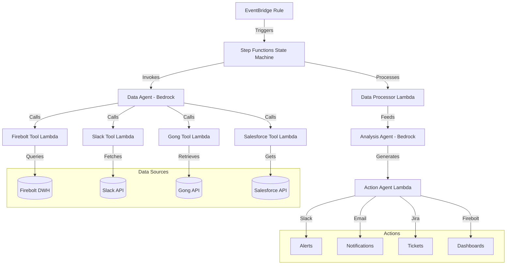
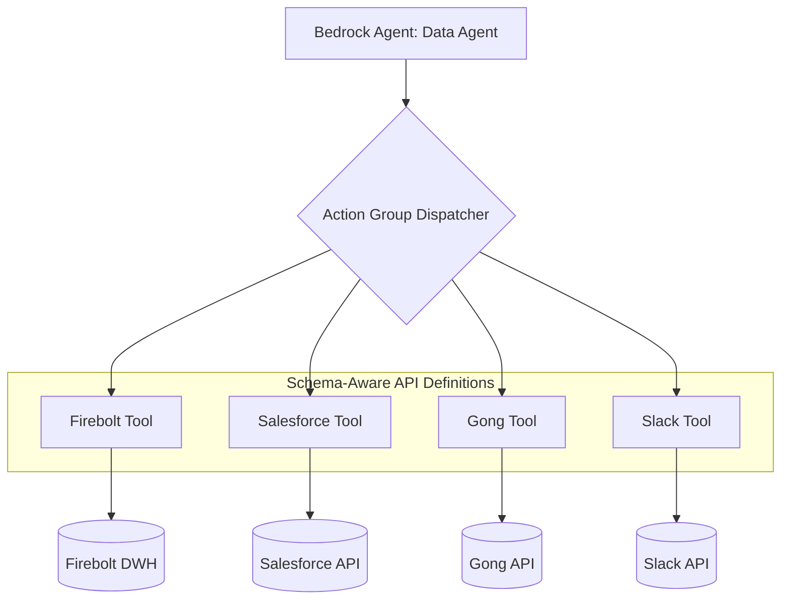

# RevOps AI Agent Framework - Architecture Specification

**Document Version:** 2  
**Date:** May 2025  
**Status:** Schema-Aware Implementation

## Table of Contents

- [Executive Summary](#executive-summary)
- [Architecture Overview](#architecture-overview)
- [System Components](#system-components)
- [Deployment Architecture](#deployment-architecture)
- [Implementation Phases](#implementation-phases)
- [Configuration Management](#configuration-management)
- [Success Metrics](#success-metrics)
- [Security & Compliance](#security--compliance)
- [Integration Patterns](#integration-patterns)
- [Data Handling & Processing](#data-handling--processing)
- [Performance Optimization](#performance-optimization)
- [Troubleshooting Guide](#troubleshooting-guide)
- [Use Cases & Case Studies](#use-cases--case-studies)
- [Future Enhancements](#future-enhancements)

## Executive Summary

This document defines the architecture for a RevOps AI Agent Framework built on AWS and Amazon Bedrock. The system uses a shared intelligent Data Agent pattern with specialized analysis agents to process revenue operations data and generate actionable insights.

### Business Value Proposition

- **Revenue Intelligence**: Proactively identify at-risk accounts, closed-lost opportunity patterns, and upsell opportunities
- **Operational Efficiency**: Reduce manual analysis time by 80% through intelligent automation
- **Customer Experience**: Identify customer health issues before they escalate to churn risks
- **Data Integration**: Unified view across previously siloed data sources (Firebolt, Salesforce, Gong, Slack)
- **ROI Potential**: Conservative estimate of 3-5% revenue retention improvement through early intervention

## Architecture Overview

### High-Level Flow
```
EventBridge Rule 
  ↓
Step Functions State Machine
  ↓  
Data Agent (Bedrock Agent)
  ├── Tool: Firebolt Query Executor (Lambda)
  ├── Tool: Slack Data Fetcher (Lambda) 
  ├── Tool: Gong Data Fetcher (Lambda)
  └── Tool: Salesforce Data Fetcher (Lambda)
  ↓
Analysis Agent (Bedrock Model via Step Functions)
  ↓
Action Agent (Lambda → Zapier)
  ↓
Business Analytics Engine (Lambda → Firebolt DWH)
```

### Reference Architecture Diagram


*Note: This diagram is illustrative and can be generated using the Mermaid syntax below:*



### Core Principles
1. **Shared Data Intelligence**: Single Data Agent handles all data retrieval with built-in business logic
2. **Specialized Analysis**: Different analysis patterns for different business use cases
3. **Tool Separation**: Each data source has a dedicated, single-purpose tool
4. **Low Error Tolerance**: Comprehensive error handling and fallback mechanisms
5. **Batch Processing**: Efficient processing with controlled parallelism
6. **Data Classification**: Built-in security and access controls

## System Components

> 💡 **Design Principle**: The architecture follows a composable, domain-driven design pattern with clear separation of concerns between data retrieval, analysis, and action layers.

### 1. Trigger Layer

**AWS EventBridge Rule**
- **Purpose**: Scheduled execution of analysis workflows
- **Configuration**: Cron-based scheduling (daily, weekly, etc.)
- **Target**: Step Functions State Machine
- **Payload Structure**:
```json
{
  "triggerType": "scheduled",
  "analysisType": "A1|A2|A3|A4|A5|A6", 
  "maxOpportunities": 100,
  "sessionId": "analysis_YYYYMMDD_HHMMSS"
}
```

### 2. Orchestration Layer

**AWS Step Functions (Express Workflow)**
- **Type**: Express Workflow for speed and cost efficiency
- **Timeout**: 15 minutes
- **Execution Role**: Permissions for Bedrock, Lambda, S3, SQS, Knowledge Base
- **Parallelism**: Controlled batch processing (3 batches, 5 concurrent per batch)

**State Machine Definition**:
```json
{
  "Comment": "RevOps Analysis with Intelligent Data Agent",
  "StartAt": "InvokeDataAgent",
  "States": {
    "InvokeDataAgent": {
      "Type": "Task",
      "Resource": "arn:aws:states:::bedrock:invokeAgent",
      "Parameters": {
        "agentId": "REVOPS_DATA_AGENT_ID",
        "agentAliasId": "TSTALIASID",
        "sessionId.$": "$.sessionId",
        "knowledgeBaseId": "revops-firebolt-schema",
        "inputText.$": "States.Format('Gather all data required for {} analysis. Target: {}. Additional context: {}', $.analysisType, $.target, $.context)"
      },
      "Retry": [
        {
          "ErrorEquals": ["Bedrock.ThrottlingException"],
          "IntervalSeconds": 5,
          "MaxAttempts": 3,
          "BackoffRate": 2
        }
      ],
      "Next": "ProcessDataResults"
    },
    "ProcessDataResults": {
      "Type": "Task",
      "Resource": "arn:aws:states:::lambda:invoke",
      "Parameters": {
        "FunctionName": "revops-data-processor"
      },
      "Next": "InvokeAnalysisAgent"
    },
    "InvokeAnalysisAgent": {
      "Type": "Task",
      "Resource": "arn:aws:states:::bedrock:invokeModel",
      "Parameters": {
        "ModelId": "anthropic.claude-3-sonnet-20240229-v1:0"
      },
      "Next": "InvokeActionAgent"
    },
    "InvokeActionAgent": {
      "Type": "Task",
      "Resource": "arn:aws:states:::lambda:invoke",
      "Parameters": {
        "FunctionName": "revops-action-agent"
      },
      "Next": "LogAnalytics"
    },
    "LogAnalytics": {
      "Type": "Task",
      "Resource": "arn:aws:states:::lambda:invoke",
      "Parameters": {
        "FunctionName": "revops-business-analytics",
        "InvocationType": "Event",
        "Payload": {
          "executionDetails.$": "$"
        }
      },
      "End": true
    }
  }
}
```

### 3. Data Retrieval Layer

**Schema-Aware Data Agent (Bedrock Agent)**
- **Implementation**: Amazon Bedrock Agent with action group tools and AWS knowledge base integration
- **Purpose**: Intelligent, schema-aware data retrieval and preprocessing
- **Knowledge Base**: `revops-firebolt-schema` containing comprehensive schema documentation
- **Tools**: Lambda functions for each data source
- **Memory**: Dynamic instruction prompting
- **API Definitions**: Structured OpenAPI definitions for all data sources
- **Intelligence**: Combines retrieval capabilities with business context awareness
- **Error Handling**: Comprehensive retry logic with exponential backoff
- **Connection Management**: Pooled connections to data sources with connection recycling
- **Response Size Optimization**: Dynamic chunk sizing based on query complexity

#### Agent Architecture



#### Agent Components

- **Instructions**: Custom guidance for the foundation model
- **Action Groups**: Schema-defined API interfaces for each data source
- **Lambda Handlers**: Specialized functions for each data source
- **Response Processor**: Formats and enriches data with business context

CREATE TABLE revops_consumption_patterns (
    pattern_id TEXT,
    execution_id TEXT,
    execution_timestamp TIMESTAMP,
    account_id TEXT,

{
  "sessionId": "analysis_20250126_001",
  "analysisType": "A1",
  "target": "account_abc123", 
  "context": "closed_lost_opportunities",

class DataClassifier:
    """Enforces data classification policies during Agent operations"""
    
    CLASSIFICATION_LEVELS = {
        "PUBLIC": {"can_embed": True, "retention_days": 365, "needs_anonymization": False},

- **GDPR**: Data classification supports GDPR requirements for data minimization and retention
- **CCPA**: California Consumer Privacy Act considerations for customer data handling

## Data Handling & Processing

### Data Retrieval Layer

The data retrieval layer is responsible for fetching and preprocessing data from various sources before analysis. It uses schema-aware processing powered by the AWS knowledge base integration.

#### Key Features

- **Automatic Chunking**: Large query results are automatically split into manageable chunks
- **Progressive Processing**: Analysis Agent can begin processing data as soon as the first chunk arrives
- **Metadata-First Design**: Initial response includes dataset metadata and first chunk
- **Zero Storage Dependencies**: No intermediate storage systems required

#### Implementation

**Data Agent Response Format:**

```json
// For large datasets (first response)
{
  "success": true,
  "error": null,
  "chunked": true,
  "chunk_index": 0,
  "total_chunks": 5,
  "total_rows": 4328,
  "rows_per_chunk": 1000,
  "columns": ["account_id", "usage_date", "query_count", "data_scanned_bytes"],
  "results": [...],  // First chunk of data (up to rows_per_chunk rows)
  "query_info": {
    "query": "SELECT * FROM usage_logs WHERE...",
    "secret_name": "firebolt-credentials",
    "region_name": "eu-north-1",
    "api_region": "us-east-1"  // Added support for specifying API region
  }
}

// For small datasets (single response)
{
  "success": true,
  "error": null,
  "chunked": false,
  "columns": ["account_id", "usage_date", "query_count"],
  "results": [...]  // All results
}
```

#### Analysis Agent Implementation

The Analysis Agent should implement logic to handle chunked responses:

```python
def process_firebolt_data(response):
    """Process data from Firebolt query, handling chunked responses"""
    
    # Check if response is chunked
    if not response.get("chunked", False):
        # Process entire result set at once
        return analyze_complete_dataset(response["results"], response["columns"])
    
    # Initialize aggregation for chunked processing
    analysis_state = initialize_analysis(response["columns"])
    
    # Process first chunk immediately
    process_data_chunk(analysis_state, response["results"])
    
    # Request and process additional chunks if needed
    if response["total_chunks"] > 1:
        query_info = response["query_info"]
        
        for chunk_idx in range(1, response["total_chunks"]):
            # Request next chunk
            chunk_response = firebolt.get_query_chunk(
                query=query_info["query"],
                secret_name=query_info["secret_name"],
                region_name=query_info["region_name"],
                chunk_index=chunk_idx,
                max_rows_per_chunk=response["rows_per_chunk"]
            )
            
            # Process this chunk
            if chunk_response["success"]:
                process_data_chunk(analysis_state, chunk_response["results"])
            else:
                log_error(f"Failed to retrieve chunk {chunk_idx}: {chunk_response['error']}")
                break
    
    # Finalize analysis with all processed data
    return finalize_analysis(analysis_state)
```

#### Benefits

1. **Lambda Compatibility**: Eliminates "Response payload size exceeded" errors
2. **Memory Efficiency**: Processes large datasets without loading everything into memory
3. **Progressive Analysis**: Enables streaming analytics and early results
4. **Fault Tolerance**: Partial results can still be analyzed if later chunks fail

## Integration Patterns

## Future Enhancements

### Roadmap (2025-2026)

| Quarter | Enhancement | Business Impact | Technical Complexity |
